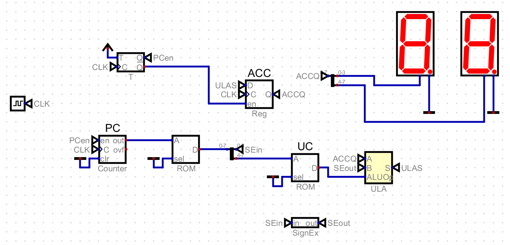
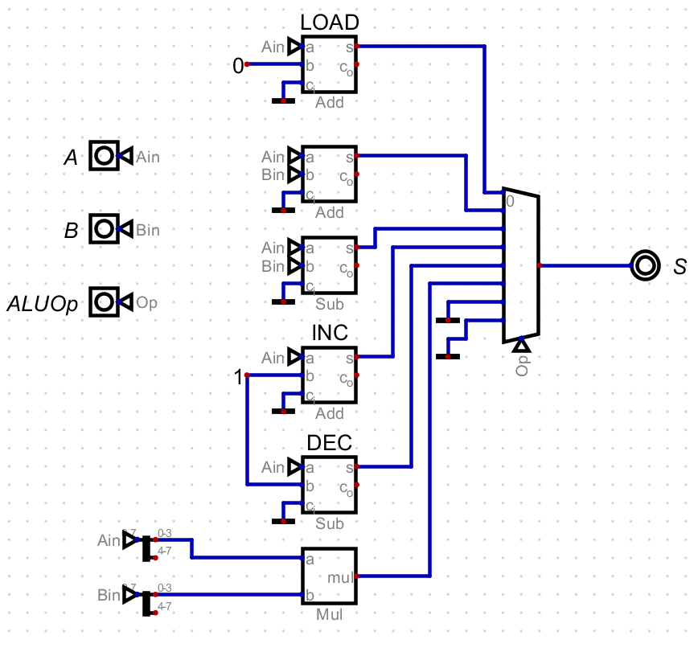

# A CPU

Este projeto consiste no desenvolvimento de uma CPU de 8 bits simplificada, utilizando o software de simulação de circuitos lógicos "Digital". O objetivo é implementar uma arquitetura básica capaz de executar um conjunto de instruções aritméticas, controlada por ciclos de busca (*fetch*) e execução (*execute*).

## **Vídeo de Demonstração**

Assista ao vídeo abaixo para uma demonstração completa do funcionamento da CPU, do processo de desenvolvimento e da execução de um programa de teste.

[Demonstração da CPU](https://youtu.be/hOLFLPuoSIc)

## **1. Arquitetura e Funcionamento**

A CPU foi projetada com um barramento de dados de 8 bits. As instruções também possuem 8 bits e seguem um formato fixo para simplificar a decodificação:

* **4 bits (MSB): Opcode** - O código que define a operação a ser executada.
* **4 bits (LSB): Operando** - Um valor imediato utilizado pela operação.

### **Conjunto de Instruções (Opcodes)**

A Unidade de Controle foi programada para reconhecer o seguinte conjunto de instruções:

| Operação | Opcode (Hex) | Ação Descrita |
| :--- | :--- | :--- |
| `LOAD` | 0 | Carrega o `Operando` no Acumulador (ACC). |
| `ADD` | 1 | Soma o `Operando` ao valor do Acumulador. |
| `SUB` | 2 | Subtrai o `Operando` do valor do Acumulador. |
| `INC` | 3 | Incrementa o valor do Acumulador em 1. |
| `DEC` | 4 | Decrementa o valor do Acumulador em 1. |
| `MUL` | 5 | Multiplica os 4 bits inferiores do ACC pelo `Operando`. |

### **Ciclo de Operação (Fetch-Execute)**

O funcionamento da CPU é governado por um clock unificado e dividido em dois ciclos principais, gerenciados por um T-Flip-Flop:

1.  **Ciclo de Busca (Fetch):**
    * O Contador de Programa (PC) envia seu endereço para a Memória ROM.
    * A ROM retorna a instrução de 8 bits armazenada naquele endereço.
    * O PC é incrementado para apontar para a próxima instrução.

2.  **Ciclo de Execução (Execute):**
    * A instrução é dividida em `Opcode` e `Operando`.
    * O `Opcode` é enviado para a Unidade de Controle (UC), que o decodifica e envia o sinal de comando apropriado para a ULA.
    * A ULA executa a operação utilizando o valor do Acumulador (ACC) e o `Operando` da instrução.
    * O resultado da operação é armazenado de volta no Acumulador.

## **2. Imagens dos Circuitos**

### **Circuito Principal (`cpu_rom.dig`)**

A imagem abaixo mostra a arquitetura completa da CPU, integrando todos os componentes principais.

### **Subcircuito da ULA (`ULA.dig`)**

A Unidade Lógica e Aritmética foi construída como um subcircuito para modularizar o projeto.

## **3. Descrição dos Componentes**

### **Componentes do Circuito Principal (`cpu_rom.dig`)**

* **Clock:** Sincroniza todas as operações, garantindo que os ciclos de Fetch e Execute ocorram em ordem.
* **Contador de Programa (PC):** Um contador de 8 bits que aponta para o endereço da próxima instrução a ser buscada na memória.
* **Memória de Instruções (ROM):** Uma memória somente de leitura que armazena o programa a ser executado. Foi implementada com um componente `ROM`.
* **Unidade de Controle (UC):** Implementada com uma `ROM`, atua como um decodificador. Ela recebe o `Opcode` e o traduz em um sinal de controle para a ULA.
* **Acumulador (ACC):** Um `Register` de 8 bits que armazena o resultado da última operação da ULA e serve como a principal saída de dados do processador.
* **Unidade Lógica e Aritmética (ULA):** O subcircuito customizado que realiza todas as operações matemáticas (Soma, Subtração, etc.).
* **T-Flip-Flop:** Controla a alternância entre os ciclos de Fetch e Execute, habilitando o PC ou o Acumulador em momentos distintos.
* **Displays de 7 Segmentos:** Exibem o valor de 8 bits presente no Acumulador em formato hexadecimal.

### **Componentes do Subcircuito (`ULA.dig`)**

* **Componentes Aritméticos:** Foram utilizados os componentes `Adder`, `Subtract` e `Multiply` para realizar as operações matemáticas básicas.
* **Multiplexer (MUX):** Componente central da ULA. Ele recebe os resultados de todas as operações possíveis e, com base no sinal de controle vindo da UC, seleciona qual resultado será a saída final da ULA.
* **Splitter/Merger e Sign Extender:** Componentes auxiliares para dividir e estender barramentos de dados, garantindo que os operandos de 4 bits da instrução e da operação de multiplicação sejam compatíveis com o barramento principal de 8 bits.